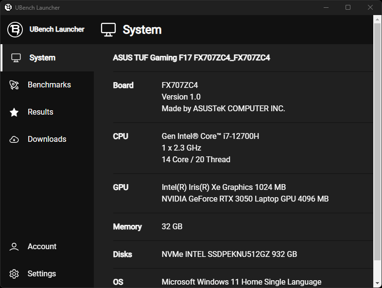

<div align="center">
  <a href="https://github.com/github_username/repo_name">
    
  </a>

<h3 align="center">UBench Launcher</h3>
<hr>
</div>

### Table of Contents
  <ol>
    <li>
      <a href="#about-the-project">About The Project</a>
    </li>
    <li>
      <ul>
        <li><a href="#prerequisites">Prerequisites</a></li>
        <li><a href="#running">Running</a></li>
        <li><a href="#packaging">Packaging</a></li>
      </ul>
    </li>
    <li><a href="#usage">Usage</a></li>
    <li><a href="#license">License</a></li>
  </ol>

## About The Project

UBench Launcher is a download manager and launcher utility client for the UBench benchmarking system. UBench Launcher allows users to download, run and report system benchmarks for **Unreal Engine**. UBench Launcher is built with `Electron`. 

  <a href="https://github.com/github_username/repo_name">
    
  </a>


## Prerequisites

You must install the required `modules` first
```sh
npm i
```

## Running

UBench Launcher can be run for development purposes by executing 
```sh
npm run start
```

## Packaging

Targets are built using `electron-forge` by running 
```sh
npm run package
```

## License

Distributed under the MIT License. See [LICENSE.TXT](license.txt) for more information.

## Contact

[UBench Organization Email](mailto:ubench.org@gmail.com)

<hr>

[ubench.org](http://www.ubench.org)